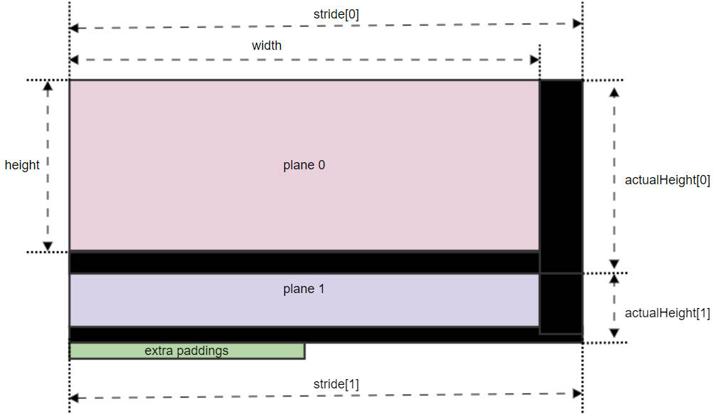
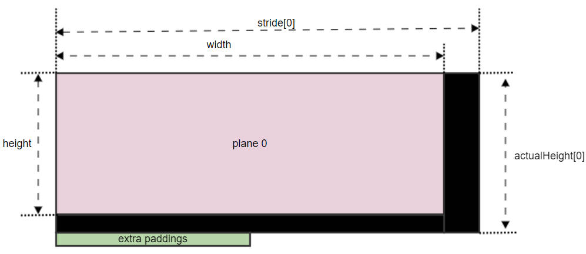
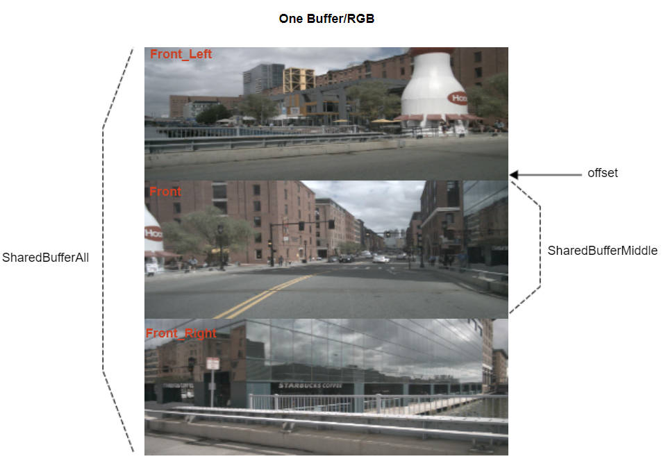

# 1. RideHal Buffer Data Structures

- [RideHal_Buffer_t](../include/ridehal/common/Types.hpp#L89)
- [RideHal_ImageProps_t](../include/ridehal/common/Types.hpp#L118)
- [RideHal_TensorProps_t](../include/ridehal/common/Types.hpp#L148)
- [RideHal_SharedBuffer_t](../include/ridehal/common/SharedBuffer.hpp#L15)

## 1.1 The details of image properties.

As the hardware reasons, the actual buffer used to hold an image may has alignment paddings along width and height for the zero copy purpose to share with the hardware accelerator, but an image with certain width and height, it can has no paddings at all.

And the below picture shows a case what's the actual buffer looks like for an image format such as NV12 that has 2 planes, the black area is paddings space thus not valid pixels.

For each plane, it may have paddings along width and height, it may also has paddings between the 2 planes. And some extra paddings is also needed at the end of the last plane.

And the below picture shows a case what's the actual buffer looks like for an image format such as RGB that has 1 plane.

Thus now, it's easy to understand those members of the type [RideHal_ImageProps_t](../include/ridehal/common/Types.hpp#L118) except batchSize and compressedSize.

For the batchSize, it was generally designed for the BEV kind of AI models, check below section[A RideHal_SharedBuffer_t image for BEV kind of AI model](#a-ridehal_sharedbuffer_t-image-for-bev-kind-of-ai-model).

For the compressedSize, it was designed for the compressed image with the format H264 or H265, and the code [SANITY_CompressedImageAllocateByProps](../tests/unit_test/buffer/gtest_Buffer.cpp#L218) which gives an example that how to allocate a buffer for a compressed image and this is the only way. And please note that for the compressed image, the member stride/actualHeight/numPlanes/extraPadding will be invalid and should not be used.

# 2. RideHal buffer APIs

- [Allocate an image with the best alignment that can be shared between CPU/GPU/VPU/HTP, etc](../include/ridehal/common/SharedBuffer.hpp#L54)

- [Allocate a batched images with the best alignment that can be shared between CPU/GPU/VPU/HTP, etc](../include/ridehal/common/SharedBuffer.hpp#L68)

- [Allocate an image(s) with specified image properties](../include/ridehal/common/SharedBuffer.hpp#L78)

# 3. RideHal_SharedBuffer_t Examples

For an ADAS perception application, the buffers are generally allocated during the initialization phase and then on ping-pong used during running, and only will be released when the application exit.

## 3.1 A RideHal_SharedBuffer_t image for BEV kind of AI model

Generally, for the BEV kind of AI models, it was that multiple cameras’ frame are preprocessed and saved into 1 RGB buffer, and generally it was 6 or 7 cameras, but here gives an example with 3 cameras case.

The [SANITY_ImageAllocateRGBByProps](../tests/unit_test/buffer/gtest_Buffer.cpp#L168) demonstrate that how to allocate such a batched image(batchSize=3), the ShareBufferAll will represent the whole buffer that contain the 3 RGB images. And use the API [GetSharedBuffer](../include/ridehal/common/SharedBuffer.hpp#L101) to get a shared buffer descriptor ShareBufferMiddle to represent the middle front camera RGB image.

Thus, the SharedBufferAll can be feed into the BEV kind of the AI models, and the ShareBufferMiddle can be feed into a traffic light detection AI model for example, thus for the traffic light detection AI model, it doesn't need another pre-processing to convert the front camera frame to RGB, just reused the middle portion of the SharedBufferAll to save computing resource.

