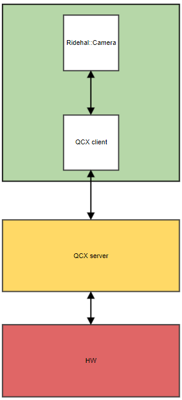
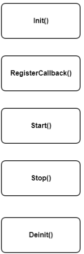

*Menu*:
- [1. Introduction](#1-Introduction)
  - [1.1 Functional overview](#11-Functional-overview)
  - [1.2 Operational overview](#12-Operational-overview)
- [2. Data structures](#2-Data-structures)
  - [2.1 Type definitions](#21-Type-definitions)
    - [2.1.1 Camera frame structure](#211-Camera-frame-structure)
    - [2.1.2 Camera input structure](#212-Camera-input-structure)
    - [2.1.3 Camera configuratione](#213-Camera-configuration)
    - [2.1.4 Callback function for frame done](#214-Callback-function-for-frame-done)
    - [2.1.5 Callback function for camera event](#215-Callback-function-for-camera-event)
  - [2.2 APIs](#22-APIs)
- [3. Typical use case and sample codes](#3-Typical-use-case-and-sample-codes)
  - [3.1 Non request buffer mode](#31-Non-request-buffer-mode)
  - [3.2 Request buffer mode](#32-Request-buffer-mode)
  - [3.3 Set external allocated buffers to Camera](#33-Set-external-allocated-buffers-to-Camera)


# 1. Introduction
This document describes Ridehal Camera APIs, and it provides the corresponding code samples that show how to use them.

## 1.1 Functional overview
Ridehal Camera is a Ridehal component. It's a warpper of Qcarcam which provides user friendly APIs for easy integration of camera on ADAS use case. 



## 1.2 Operational overview
A Camera instance can be operated via a sequence of function calls for optimal execution as described below:

At the very beginning, Init() is called to configure the parameters and create a camera session. Then we shall call RegisterCallback() to register a event callback which handles the frame callback and event callback from camera driver. Now we can call Start() to trigger the start of the camera hardware to process signals from sensors. Frame done callback shall be triggered once a new frame is received from camera. Application shall return the frame back to camera once the processing is done. Stop() can be called to
stop the streaming at any time when camera is running. At the end we need to call Deinit() to destroy the camera session.     




# 2. Data structures
## 2.1 Type definitions
### 2.1.1 Camera frame structure
```c
typedef struct
{
    RideHal_SharedBuffer_t sharedBuffer; /**< Shared buffer associated with the image */
    uint64_t timestamp;                  /**< Hardware timestamp (in nanoseconds) */
    uint64_t timestampQGPTP;             /**< Generic Precision Time Protocol (GPTP) timestamp in nanoseconds */
    uint32_t frameIndex;                 /**< Index of the camera frame */
    uint32_t flags;                      /**< Flag to indicate error state of the buffer */
} CameraFrame_t;
```
### 2.1.2 Camera input structure
```c
typedef struct
{
    QCarCamInput_t      *pCameraInputs;  /**< pointer to the list of qcarcam inputs info */
    QCarCamInputModes_t *pCamInputModes; /**< pointer to the list of qcarcam input modes for each input */
    uint32_t            numInputs;       /**< num of qcarcam inputs */
} CameraInputs_t;
```
### 2.1.3 Camera configuration
```c
typedef struct Camera_Config
{
    bool bAllocator;              /**< Flag to indicate if component is buffer allocator*/
    bool bRequestMode;            /**< Flag to set request buffer mode */
    uint32_t streamId;            /**< Camera stream id */
    uint32_t inputId;             /**< Camera input id */
    uint32_t ispUserCase;         /**< ISP user case defined by qcarcam */
    uint32_t width;               /**< Frame width */
    uint32_t height;              /**< Frame height */
    uint32_t fps;                 /**< Frames per second */
    uint32_t bufCnt;              /**< Buffer count set to camera */
    uint32_t camFrameDropPat;     /**< Frame drop patten defined by qcarcam */
    uint32_t opMode;              /**< Operation mode defined by qcarcam */
    RideHal_ImageFormat_e format; /**< Camera frame format */
} Camera_Config_t;
```
### 2.1.4 Callback function for frame done
```c
typedef void ( *RideHal_CamFrameCallback_t )( CameraFrame_t *pFrame, void *pPrivData );
```
### 2.1.5 Callback function for camera event 
```c
typedef void ( *RideHal_CamEventCallback_t )( const uint32_t eventId, const void *pPayload, void *pPrivData );
```
## 2.2 APIs
```c
    /**
     * @brief init the Camera object
     *
     * @param[in] pName   Name of the component
     * @param[in] pConfig Camera configurations
     * @param[in] level   Logging level
     *
     * @return RIDEHAL_ERROR_NONE on success, others on failure
     */
    RideHalError_e Init( char *pName, const Camera_Config_t *pConfig,
                         Logger_Level_e level = LOGGER_LEVEL_ERROR );

    /**
     * @brief Start the Camera object
     *
     * @return RIDEHAL_ERROR_NONE on success, others on failure
     */
    RideHalError_e Start() final;

    /**
     * @brief Stop the Camera object
     *
     * @return RIDEHAL_ERROR_NONE on success, others on failure
     */
    RideHalError_e Stop() final;

     /**
     * @brief Deinit the Camera object
     *
     * @return RIDEHAL_ERROR_NONE on success, others on failure
     */
    RideHalError_e Deinit() final;

   /**
     * @brief Pause the Camera object
     *
     * @return RIDEHAL_ERROR_NONE on success, others on failure
     */
    RideHalError_e Pause();

   /**
     * @brief Resume the Camera object
     *
     * @return RIDEHAL_ERROR_NONE on success, others on failure
     */
    RideHalError_e Resume();

    /**
     * @brief release a camera frame
     *
     * @param[in] pFrame the camera frame to be released
     *
     * @return RIDEHAL_ERROR_NONE on success, others on failure
     */
    RideHalError_e ReleaseFrame( CameraFrame_t *pFrame );

    /**
     * @brief request a frame from camera
     *
     * @param[in] pFrame the frame to request from camera
     *
     * @return RIDEHAL_ERROR_NONE on success, others on failure
     */
    RideHalError_e RequestFrame( CameraFrame_t *pFrame );

        /**
     * @brief set a list of shared buffers to camera
     *
     * @param[in] pBuffer Pointer to the buffer list
     * @param[in] numBuffers Number of buffers in the list
     *
     * @return RIDEHAL_ERROR_NONE on success, others on failure
     */
    RideHalError_e SetBuffers( const RideHal_SharedBuffer_t *pBuffer, uint32_t numBuffers );

    /**
     * @brief register callbacks to camera
     *
     * @param[in] frameCallback Frame callback function
     * @param[in] eventCallback Event callback function
     * @param[in] pAppPriv App private data
     *
     * @return RIDEHAL_ERROR_NONE on success, others on failure
     */
    RideHalError_e RegisterCallback( RideHal_CamFrameCallback_t frameCallback,
                                     RideHal_CamEventCallback_t eventCallback, void *pAppPriv );

    /**
     * @brief get camera inputs info
     *
     * @param[out] pCamInputs Input info queried from Camera
     *
     * @return RIDEHAL_ERROR_NONE on success, others on failure
     */
    RideHalError_e GetInputsInfo( CameraInputs_t *pCamInputs );

```
# 3. Typical use case and sample codes

## 3.1 Non request buffer mode
Camera works on non request buffer mode when bRequestMode is set to false in camera config. In this mode new camera frames are delivered in frame callback function and user shall release the frame back to camera when processing of the frame is done in application.
```c
Camera_Config_t camConfig;
camConfig.bRequestMode = false;

static void FrameCallBack( CameraFrame_t *pFrame, void *pPrivData )
{
    RideHalError_e ret;
    
    /* Do something to process the camera frame */

    ret = pCamera->ReleaseFrame( pFrame ); // release frame to camera
}

```

## 3.2 Request buffer mode
Camera works on request buffer mode when bRequestMode is set to true in camera config. In this mode new camera frames are delivered in frame callback function and user can request new frames from camera when processing of the frame is done in application.
```c
Camera_Config_t camConfig;
camConfig.bRequestMode = true;

static void FrameCallBack( CameraFrame_t *pFrame, void *pPrivData )
{
    RideHalError_e ret;
    
    /* Do something to process the camera frame */

    ret = pCamera->RequestFrame( pFrame ); // Requset new frame from camera
}
```

## 3.3 Set external allocated buffers to Camera
Camera will alllcate shared buffers internally at Init() if bAllocator is set to true. Also user can allocate buffers externally and set them to camera. In such case bAllocator needs to be set to false. Buffers shall be allocated and set to camera after Init() call. 
```c
Camera_Config_t camConfig;
camConfig.bRequestMode = false;

Camera *pCamera = new Camera;
RideHal_SharedBuffer_t *pSharedBuffer = new RideHal_SharedBuffer_t[BUFFFER_COUNT];

for ( int i = 0; i < BUFFFER_COUNT; i++ )
{
    ret = pSharedBuffer[i].Allocate( camConfig.width, camConfig.height, camConfig.format );
}

pCamera->Init( componentName, &camConfig, LOGGER_LEVEL_ERROR );

pCamera->SetBuffers( pSharedBuffer, BUFFFER_COUNT );

...
```